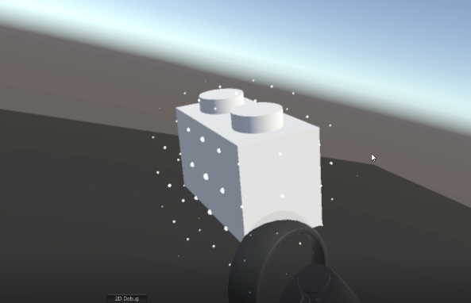

# Grid

This is a custom grid which could have a translated + rotated coordinate system. You can move and rotate the local coordinate system however you like and get the world position of the grid point that's closest to a given point. This is usefull when you want to snap a game object to a custom coordinate system.

---

Remember to clone me with [core.symlinks=true](https://github.com/git-for-windows/git/wiki/Symbolic-Links) option!!